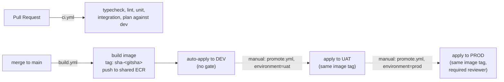

# Spec 12 — Multi-Environment (DEV/UAT/PROD) CI/CD

Extends spec 09 (Terraform) and spec 10 (CI/CD) — read those first. This spec is the authoritative update where they now diverge (single-environment framing); it does not restate what's unchanged.

## Topology decision

**One AWS account, three environments, isolated by resource naming + separate Terraform state** — not three AWS accounts, not Terraform workspaces.

- **Why not three accounts**: full account separation (AWS Organizations, cross-account roles) is the "correct" enterprise answer, but it's a big jump in setup cost for a solo project already committed to "cheapest viable" (`../docs/roadmap.md`). One account keeps `terraform/README.md`'s bootstrap steps valid as-is.
- **Why not workspaces**: workspaces share the same `.tf` files implicitly and make it easy to `apply` against the wrong environment by forgetting to `workspace select`. Explicit `-backend-config`/`-var-file` per environment (below) makes the target environment a visible argument on every command, not ambient state.
- **Why one shared root module**: environment-specific directories (`envs/dev/*.tf`, `envs/uat/*.tf`, ...) drift apart over time as each gets hand-edited independently. One root module + one `environment` variable threaded into every resource name is the only way DEV, UAT, and PROD are guaranteed to be the same infrastructure shape.

## `environment` variable and resource naming

```hcl
variable "environment" {
  type = string
  validation {
    condition     = contains(["dev", "uat", "prod"], var.environment)
    error_message = "environment must be one of: dev, uat, prod"
  }
}
```

Every environment-scoped resource gets an `-${var.environment}` suffix (or equivalent for bucket-naming rules):

| Resource | Name pattern |
|---|---|
| DynamoDB table | `ScrapedJobs-${environment}` |
| S3 snapshot bucket | `job-snapshots-${environment}-${account_id}` |
| SQS queue / DLQ | `job-scrape-queue-${environment}` / `job-scrape-dlq-${environment}` |
| Lambda functions | `list-jobs-${environment}` / `job-detail-${environment}` |
| IAM roles | `serverless-job-scraper-${environment}-list-jobs` / `-job-detail` / `-scheduler` |
| EventBridge schedule group | `serverless-job-scraper-${environment}` |
| SNS topic | `job-scrape-alerts-${environment}` |
| CloudWatch alarms | `<alarm-name>-${environment}` |

**Exception — the ECR repository is NOT environment-scoped.** One shared repository holds every image, tagged by git SHA. This is what makes "build once, promote the same artifact" (below) possible — an image built for DEV and an image promoted to PROD are byte-identical, not separately rebuilt.

## Terraform state — one bucket, one key per environment

The state bucket/lock table from `terraform/README.md` step 7 are shared (bootstrapped once, regardless of environment count). Each environment gets its own **state file key** in that same bucket:

```
s3://<state-bucket>/serverless-job-scraper/dev/terraform.tfstate
s3://<state-bucket>/serverless-job-scraper/uat/terraform.tfstate
s3://<state-bucket>/serverless-job-scraper/prod/terraform.tfstate
```

```bash
terraform init \
  -backend-config="bucket=$STATE_BUCKET" \
  -backend-config="dynamodb_table=$LOCK_TABLE" \
  -backend-config="region=$REGION" \
  -backend-config="key=serverless-job-scraper/${ENVIRONMENT}/terraform.tfstate"
```

## Per-environment tfvars: `terraform/envs/{dev,uat,prod}.tfvars`

Each sets `environment` and `enable_schedule` — safe to commit, no secrets. `alert_email` deliberately stays **out** of these files: it's supplied at apply time as `TF_VAR_alert_email` from that GitHub Environment's own variables (`deploy.yml`, below) — the same pattern spec 10 already used, and it keeps an email address out of version control while still letting DEV/UAT/PROD route alerts to different addresses if wanted.

## `enable_schedule` — DEV/UAT never run the real cron

**DEV and UAT do not create `aws_scheduler_schedule` resources.** If all three environments ran the same daily SEEK schedule, that's the pipeline scraping the same SEEK search **three times a day** instead of once — directly working against the politeness/anti-bot-detection concerns already designed into this pipeline (spec 09's "Concurrency control"), for zero benefit (DEV/UAT don't need fresh data on a cron; they need on-demand testing).

```hcl
variable "enable_schedule" {
  type    = bool
  default = false
}
```

```hcl
# eventbridge.tf
resource "aws_scheduler_schedule" "list_jobs" {
  for_each = var.enable_schedule ? var.sources : {}
  # ...
}
```

- `dev.tfvars` / `uat.tfvars`: `enable_schedule = false` — Lambda A/B, the queue, the table, and the bucket all still exist and can be invoked manually (`aws lambda invoke`) for testing; there's just no automatic trigger.
- `prod.tfvars`: `enable_schedule = true`.

## Build-once, promote-the-same-artifact

The container image is built and pushed to ECR **exactly once per commit to `main`**, tagged with the git SHA. DEV, UAT, and PROD each run `terraform apply` with `container_image_uri` pointing at that *same* tag — never a separate build per environment. This is the whole point of having environments: what UAT validated is byte-identical to what PROD runs, not "the same source rebuilt, hopefully identically."

## Pipeline shape



### `ci.yml` (extends spec 10 — unchanged jobs, plus:)

- `terraform-plan` now runs with `-var-file=envs/dev.tfvars` and DEV's backend key. Planning against DEV on every PR is free signal; UAT/PROD plans are deliberately not run automatically (see `promote.yml` below — a human triggers those, and sees the plan before approving apply).

### `build.yml` (replaces the "build" half of the old `cd.yml`)

- Trigger: push to `main`.
- Builds the Dockerfile once, tags `<ecr-repo>:sha-<git-sha>`, pushes to the shared ECR repo.
- On success, triggers (or is followed by) an automatic DEV deploy — no approval gate, since DEV is meant to always reflect `main`.

### `deploy.yml` (reusable workflow, called for every environment)

- Inputs: `environment` (`dev`/`uat`/`prod`), `image_tag`.
- `terraform init` with that environment's backend key, `terraform apply -var-file=envs/<environment>.tfvars -var="container_image_uri=<repo>:<image_tag>"`.
- Runs inside the matching GitHub **Environment** (`dev`/`uat`/`prod`), so branch/reviewer protection rules apply per-environment (below) without duplicating workflow logic.

### `promote.yml` (manual promotion to UAT or PROD)

- Trigger: `workflow_dispatch`, inputs `environment` (choice: `uat`, `prod`) and `image_tag` (the SHA-tagged image already deployed to DEV — explicit, not inferred, so there's never ambiguity about which artifact is being promoted).
- Calls `deploy.yml` with those inputs.

## GitHub Environments — protection increases with blast radius

| Environment | Required reviewer | Deployment branch restriction |
|---|---|---|
| `dev` | No | `main` only |
| `uat` | Optional (team's call) | `main` only |
| `prod` | **Yes** (unchanged from spec 10) | `main` only |

Same OIDC role can back all three (it's scoped to this project's resource types and IAM role-name prefix per `terraform/README.md` step 3a, and that prefix now includes `-${environment}-`, so its IAM policy's `Resource` pattern `serverless-job-scraper-*` is already broad enough — no change needed there since `dev`/`uat`/`prod` are inside the `-*` wildcard).

## GitHub-side one-time setup (do this before any of the above workflows can run)

1. **Create three GitHub Environments**: Settings → Environments → `dev`, `uat`, `prod`. Set required reviewers + deployment branch restriction per the table above (`prod` needs a required reviewer; `dev`/`uat` at minimum restrict deployments to `main`).
2. **Repository-level variables** (Settings → Secrets and variables → Actions → Variables — visible to every environment, since the resource they identify is shared): `AWS_TERRAFORM_ROLE_ARN`, `AWS_REGION`, `TF_STATE_BUCKET`, `TF_STATE_LOCK_TABLE`, `ECR_REPOSITORY_URL` (the shared repo's URL — from `terraform output ecr_repository_url` once it exists, or `<account-id>.dkr.ecr.<region>.amazonaws.com/serverless-job-scraper`).
3. **Per-environment variable, set inside each of the three Environments**: `ALERT_EMAIL` — can be the same address for all three, or different if you want DEV/UAT alarm noise routed elsewhere than PROD's.
4. The OIDC role behind `AWS_TERRAFORM_ROLE_ARN` is created in `terraform/README.md` step 3a (a distinct, keyless identity from step 3's human IAM user), with a trust policy scoped to this specific GitHub repo — one role, reused by `ci.yml`, `build.yml`, and every `deploy.yml` invocation regardless of target environment.

## Acceptance criteria

- [ ] `terraform plan -var-file=envs/dev.tfvars` and `-var-file=envs/prod.tfvars` against a clean account both succeed and produce disjoint resource names (no collision if both were applied to the same account simultaneously).
- [ ] `enable_schedule = false` (DEV/UAT default) produces zero `aws_scheduler_schedule` resources in the plan.
- [ ] Promoting to PROD without first having a corresponding DEV deploy of that `image_tag` is possible but requires the human triggering `promote.yml` to type the tag explicitly — there is no default that could silently promote the wrong image.
- [ ] The `prod` GitHub Environment cannot be deployed to without a required-reviewer approval, even via `workflow_dispatch`.
