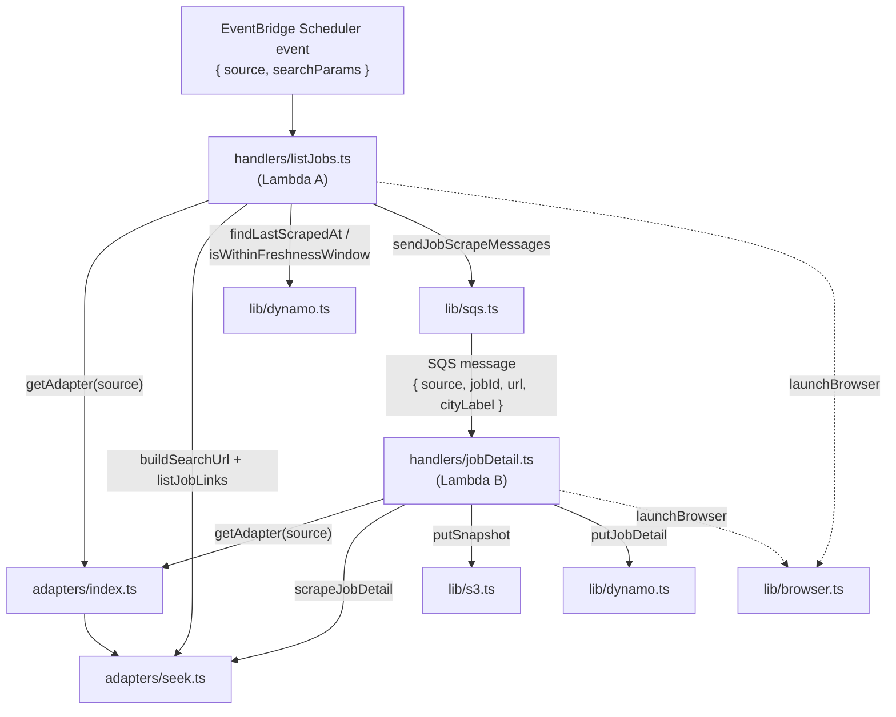

# `src/` — module index

Every file below now also carries a short **Purpose / Exports / Used by** header comment at the top — this document is the detailed, cross-referenced version of the same information, with the data flow that ties them together. See `../specs/` for the full contract each module implements, and `../AGENTS.md` for the repo-wide conventions (spec-driven workflow, the `process.env` boundary) these modules exist to enforce.

## Data flow (how these modules compose at runtime)

Both handlers are thin: they orchestrate calls into `adapters/` (site-specific scraping) and `lib/` (AWS access + config), and hold none of that logic themselves.

## `types/`

| File | Purpose |
|---|---|
| `types/job.ts` | The `JobDetail` shape written to DynamoDB, `JobSection`, `JobSource`, and `buildJobKey()` — the one function allowed to construct a `jobKey` (`${source}#${jobId}`). Everything downstream of a scrape eventually becomes a `JobDetail`. |

## `adapters/` — the site-agnostic scraping layer

| File | Purpose |
|---|---|
| `adapters/types.ts` | The contract: `SearchParams` (what to search for, spec 01) and `JobSiteAdapter` (`buildSearchUrl`/`listJobLinks`/`scrapeJobDetail`, spec 02). Pure types — no implementation. |
| `adapters/seek.ts` | The only implemented adapter. Ported from `../../seek-scrape-jobs.spec.ts`. Owns everything SEEK-specific: URL construction, CSS selectors, pagination/next-button detection, the DOM-walking section extractor, and the network-error retry policy. |
| `adapters/index.ts` | `getAdapter(source)` — the registry both handlers call instead of importing `seek.ts` directly. Adding Indeed/LinkedIn means adding one entry here, not touching a handler. |
| `adapters/seek.fixtures/*.html` | Scrubbed, hand-built SEEK HTML fixtures (`results-page.html`, `results-page-last.html`, `job-detail.html`) that let `seek.ts`'s tests drive a real headless browser with zero real network calls — see each file's own header comment for exactly what it exercises. |

## `handlers/` — the two Lambda entrypoints

| File | Purpose |
|---|---|
| `handlers/listJobs.ts` | **Lambda A.** Walks every result page for one source/search, skip-checks each job against DynamoDB, enqueues the rest. Never opens a job-detail page (spec 04) — that's what keeps it fast enough to never approach the 15-minute Lambda ceiling. |
| `handlers/jobDetail.ts` | **Lambda B.** Consumes one SQS message, scrapes exactly one job, writes the HTML snapshot to S3 and the structured item to DynamoDB — S3 first, always (spec 05), so a DynamoDB item never references a snapshot that doesn't exist. |

## `lib/` — AWS access and configuration, kept out of the handlers/adapters

| File | Purpose |
|---|---|
| `lib/env.ts` | `getRequiredEnv` / `parseIntEnv` — the two low-level primitives every other `lib/` module's env-backed getter is built on. |
| `lib/config.ts` | `loadSearchParamsFromEnv()` — the *only* function in this repo allowed to build a `SearchParams` from environment variables (local/manual runs); `getSkipWindowHours()` — the re-scrape freshness window Lambda A reads. |
| `lib/browser.ts` | `launchBrowser()` — picks `@sparticuz/chromium` inside Lambda or a normal local Chromium otherwise, so neither handler has to know which environment it's running in. |
| `lib/dynamo.ts` | All DynamoDB access: `putJobDetail`, the skip-check `findLastScrapedAt` (queries the `listingUrl-index` GSI), and the pure `isWithinFreshnessWindow` helper. Table name is read from `SCRAPED_JOBS_TABLE_NAME` (environment-scoped by Terraform — spec 12), never hardcoded. |
| `lib/s3.ts` | All S3 access: `getSnapshotBucketName()` + `putSnapshot()`. |
| `lib/sqs.ts` | All SQS access: `getJobScrapeQueueUrl()` + `sendJobScrapeMessages()` (chunks into batches of 10, SQS's own per-call limit). |
| `lib/messages.ts` | The two payload types that cross a process boundary — `ListJobsEvent` (EventBridge → Lambda A) and `JobScrapeMessage` (Lambda A → SQS → Lambda B). Pure types, no logic. |

## The one rule that shapes most of `lib/`

Per `specs/01-search-params-and-config.md`: **`adapters/**` and `handlers/**` never read `process.env` directly** — enforced by an ESLint rule (`eslint.config.mjs`), not just this document. Anything either layer needs from the environment is a named getter in `lib/` (`getSkipWindowHours()`, `getJobScrapeQueueUrl()`, `getSnapshotBucketName()`, and `lib/dynamo.ts`'s internal `getTableName()`). This is why `lib/` exists as its own layer rather than each handler reaching into `process.env` inline — it's the one deliberate seam between "what this pipeline does" and "how this deployment is configured."
